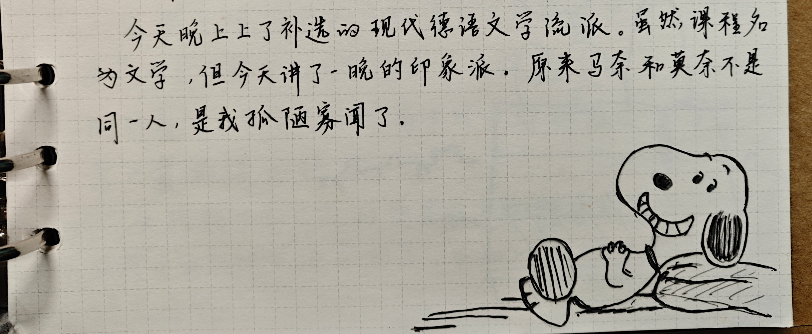

整理旧时随笔与日记，有空再挑出单独成文

## 记忆

>2017.2.24
>
>有时候总感觉自己活在记忆里。总是想寻找记忆，寻找记忆中的感觉。如每次回老家，其实只是想见见记忆中曾经留下欢笑、泪水的地方，只是想看见回忆中疼爱我的七大姑八大姨，和我玩耍抢我玩具的表兄表妹。然而每次回老家，却总是物是人非，回不去了。老房子已经塞满了新家具，有的人不在了，有的人老了，就连无比亲热的表兄表妹也有了一道深沟。偶瞥见一些没变的旧物，心里无比激动，指给妈妈看，满怀期待，却引来不接和正常的目光。也许它只活在我的回忆里，或许，活在好好回忆里的又是另外一些事物。
>
>有时寻找回忆却是想从现今的事物中找到甚至营造回忆中的事、感觉。然而常常事与愿违，怎么也找不到，却一直在寻找，就这样，寻找便成了回忆。或许将来某天，我又会寻找现在正在寻找的过程吧。
>
>想到李荣浩的《老街》，马頔的《表》，宋冬野的《安和桥》。或许活在回忆中的人不止我一个吧。

当时的本子上只是记录了月和日，2.24，我推测应该是高一的时候吧。过了这么久再看当时的这些文字只觉得好稚嫩哈哈哈。有些好矫揉造作。但是一些思考现在再看还是很有感触的。
>偶瞥见一些没变的旧物，心里无比激动，指给妈妈看，满怀期待，却引来不解和"这很正常啊"的目光。

这句话，有时候作为大人，很难去设身处地的理解到小孩子的想法。一些小孩子很珍惜的东西和感情，可能对于大人来说只是一些再也正常不过的东西。很多时候小孩子慢慢长大，这种珍视的东西也会慢慢淡化，年龄越大越淡化。以前侄女因为类似的事情不被姐姐理解的时候，还没有长大的我就很能理解。
之前看玩具总动员、飞屋环游记。很是带入，那就是小孩子应该会有的小孩子才会有的那种想法、动作。不得不说皮克斯真是太棒了。二十岁的我再看这样的电影时，就瞬间被带回去了，小时候那些玩具一定是活的，只是不会再我们面前表现出来，我们不知道而已。

>有时寻找回忆却是想从现今的事物中找到甚至营造回忆中的事、感觉。然而常常事与愿违，怎么也找不到，却一直在寻找，就这样，寻找便成了回忆。或许将来某天，我又会寻找现在正在寻找的过程吧。

以前刚去平武的时候，总是觉得身在他乡，心里想着的总是故乡，经常在寻找一些和家乡很像的景色，然后幻想这就是故乡。比如看见一座高高的山，就会想着，要是我能翻过那座山，从山顶往那头山脚看去，一定是我的故乡。那时候总是觉得平武就是异乡。
可是后来离开了平武，甚至离开了绵阳，说起故乡，不知不觉的平武、在平武的感受也浮现了出来。现在想的，不只是雅安了。

## 死亡
>2017
>
>小时候第一次认识死亡，是我爷爷的母亲，我叫她祖祖。那时候我还小，许多事情都不记得了，现在再怎样仔细地搜寻寻觅，最终只有一些片段。
>
>记得祖祖是很爱小孩的，我为数不多的记忆片段中，最多的便是祖祖那满是皱纹的笑容。她坐在藤椅上，宁静又慈祥。右手边放置着一根把手已经发亮的木拐杖。还记得拐杖上雕刻了一个龙还是什么动物，也不知道是什么木头。那根拐杖就那样静静地陪着祖祖，也不知道过了多久。祖祖宗时穿着一身朴素的蓝色布衣。她不爱美吗？或许在她的这个年龄最爱的是孩子吧。
>
>每次我和堂哥去看她，两声"祖祖"，总能让她脸上的皱纹掀起弧度，露出那秃秃的牙床。这时候她便会扶着藤椅慢慢地站起来，拄着拐杖，带着俩小屁孩，走到她的房间去了。她爱孩子，会把她儿女孝顺她的水果零食，送与我们两个小孩。或是沙琪玛之类的零食，或是苹果之类的时令水果。所以每次我和堂哥去看她，定不会空这手回。妹妹我们开心地吃着水果、零食，祖祖总会笑眯眯地看着我们，在她眼中，孩子的每一个动作都是很美好的吧。
>
>祖祖就这样住在她的老屋里，平时就坐在和她一样年老的吱吱呀呀的藤椅上，看着太阳东升西落，看二送来来往往。或许她真的年老了，又或许是她已经看到了儿孙满堂，在某天，她放下了那根拐杖。
>
>那是我第一次认识死亡，那时，祖祖的棺材放在二爷家的堂屋里，院子里。她的孩子、孩子的孩子，头上戴白，跪坐在院子里，堂屋前。那时我见过孝子最多的，跪满了半个院子。我也学父亲，头戴孝，跪在他旁边。我不记得是否有人在哭，也不记得那天父亲爷爷的表情是怎么样的。我只是静静地和他们跪在一起，不知道为什么要这样做。祖祖下葬时，我和几个小伙伴看热闹似的跟了去。漆黑的棺材，用长长的竹竿抬着，沿着山路一步一步地走向坟地。我无从知晓祖祖是哪里的人，所以无法判断她是否是落叶归根，但至少，她实在三代子孙的陪同下走的，她是含着笑走的。下葬的具体细节我记不太清楚了，之后，每年都会和爷爷一起去给她烧点纸钱，希望以这样的方式祝愿她能在另一个世界快乐的活着。

应该和上一篇是一个同一个学期写的。那时候还记得好多细节，现在我都忘记了许多了。其实那个时候什么都不懂，由于相隔三代人，对于祖祖的亲亲也并不是很深，所以对于死亡并没有很直接的感受。
还记得那时候葬礼请了喷火的表演，我和堂哥看了之后便想回家试试。我倒了一杯酒，堂哥拿着打火机，他点我喷。一口酒喝到嘴里，还没点燃打火机，便喷了出来，太辣了。便不了了之。现在想来还好当时没有尝试，不然太危险了。

## 德语文学流派

> 2020.3.2
>
> 今天晚上上了补选的现代德语文学流派。虽然课程名为文学，但今天讲了一晚的印象派。原来马奈和莫奈不是同一人，是我孤陋寡闻了。

大学里上过最好的一门课，德语学院开的一门通识课，由德语学院的院长范捷平老师主讲，侃侃而谈，所讲内容不限于文学，也不限于德国。整个欧洲的文学、艺术、建筑等等都涉及。

（20年的时候，我的字好清秀）

## 头发与侄女

> 2020.3.3
>
> 头发是越来越长了，洗完头抓着总有一种别样的舒爽。
>
> 今天把头发交给侄女，让她自由发挥。结果她边扎边笑，最后笑得不得不停止一会。最终给我扎了好几个（小揪揪）。

<Gallery names="longhair1.png longhair2.jpg longhair3.jpg longhair4.jpg longhair5.jpg" />

## 团长

> 2020.4.3
>
> 今天在忙中闲偷偷看《我的团长我的团》，不得不承认，这是我看到最好的剧。
>
> 第一集便是从衰败收容所的老兵们各自的方言中，破烂的军服、恶劣的环境向我们展示出一副落魄、潦倒。
>
> 一瘸一拐的孟烦了，是个靠装死回来的逃兵，却也看得通透，活得通透。军医却只是个五十六岁的兽医，地道西安人，像个父亲一样照顾着这一群二十多岁的孩子。迷龙，善良义气的东北爷们，一上来却是在打着偷他瓜的东北老乡。…
>
> 这部剧没有主角，也没有人有主角光环，就这是一部真实的战争剧，看哭过，看笑过。
>
> “我自认为是一千零一夜里的瓶中魔鬼，在三千年的沉寂之后，终于学会了仇恨人类，但人总是高估自己，我做不到。”
>
> 看这部剧看通了许多人情冷暖，讽刺，话外有话，拐弯抹角、真情实感、装疯卖傻。
>
> “大部分人看剧图个安逸，而《团长》不想安逸。”

> 2020.4.11
>
> 《团长》结束了，有一种鸟叫着着实吸引我。当川军团走在林中的时候，便有这种鸟叫。
>
> 噪鹃，终于在讨论各色的弹幕中寻找找到了答案。于是圆了一念想。
>
> 这个鸟鸣，总是能把我带回到大桥时，上自习课堂望窗外远处的山林时，又或是周末一人在空荡的校园玩篮球，累了看远山有一块草地上的一匹白马是否还在时。总会伴着这种鸟鸣。
>
> 感觉挺孤独的。

算了下时间，当时我竟然8天就看完了团长（也是太闲了）

不看日记，我都忘记了小时候在学校望见的那匹白马，记忆终将是会丢失的。

## 在感谢什么

>2023.06.04
>
>很感谢音乐、摇滚。感谢有点破旧但仍然能帮助我行万里的绿色逐日。也很感谢未被钢筋混凝土所吃掉的西湖。
>
>感谢泛黄的月，初夏午夜清凉的风，以及凌晨校园不多的行人。趴在在无车的知泉路上的大黄狗，以及默默行驶的汽车和忽远忽近忽黄忽白的灯光。
>
>室友有规律的呼吸声、无规律的翻身和沙沙的笔刮着纸张。耳机里唱着用一把假钞买一把假枪。脑海里思考的是用一把假枪杀死一场幻想。
>
>温度是治疗腹痛最好的良药，也是灌醉思绪最好的佳酿

不知道自己在当时感谢些什么（乐）。

那辆绿色逐日在一次暑假之后弄丢了（悲）

## 为什么要记录

> 2023.06.27
>
> 人为什么要记录？是因为记忆很不恒久，很模糊，会主观，会丢失。而记录可以让相对更客观地记录下记忆。
>
> 最重要/主要的感情需求是什么？马斯洛的需求分析理论中提到：生理（physiological need）、安全（safety need）、归属和爱的需求（belongingness and love need）、尊重的需求（esteem need）、认知（cognitive need）、审美（aesthetic need）、自我实现（self-actualization）、超越需求（transcendence needs）。其中尊重在第四层，所以我觉得尊重会在感情需求中占很大的比重。被认可、被承认、被尊重。尊重需求在人际交往中所处的地位是极高的，许多行为、思考方式都应该先思考是否已应满足的尊重这一需求。
>
> 如果能在做任何事、说任何话时都将自己抽离出来，先思考对方需求为什么，将会非常有效。

几年后回过头来再看之前的日记，更加觉得“记忆会模糊、会丢失”。毕竟有一些内容很难想象是我写出来的（比如很“矫情”的上一篇，乐）。

## 关于DDG、说唱与耍起

> 2023.7.20
>
> 今天的日记以邓典果的《耍（Hakuna Matata）》开始。首先这一首 Jersey Club 的说唱歌曲，虽然是如此，但其整体表达的氛围确不似大多 drill 或大多 Jersey Club 一样是躁动、放纵的。相反其仿佛是以歌曲中唱到的“耍”一词来表达着一种无畏与无谓。仿佛如同电影小丑中，在充满不安、危险、充满竞争与压力的哥谭市中，小丑以无畏与无所谓的态度在舞台上舞着自己属于自己的一曲。就如同节目中 DDG 所做的一样，在其他众多 Rapper 都在想着如何赢下比赛、如何为自己制造热点，如何维持自己的人设时，DDG 用一首《耍》，用一只在舞台上的肆意的，不需精雕细琢的 Drill 舞蹈，来表达着自己的态度，表达着自己对生活的态度。而他在节目中也是如此做的，他做的这一切，“只是为了耍”。
>
> DDG 的态度或许也代表了许多 Rapper 想要或者已经在做的态度。为什么 DDG 很厉害，因为他不仅有态度还有这个实力做到了，我想李尔新也是这样的态度，可惜的是他的作品不适合或者说本身实力不够，在态度和比赛中，李尔新选择的是态度，而失去了比赛；我想 AnsrJ 为什么会听哭，因为这就是他想要的样子，但在比赛和态度中，他选择了比赛。于是看见 DDG 能比赛和态度兼顾，能肆意表达，肆意耍，AnsrJ 因此应是释怀与宽慰。

原来那时候就已经有“耍起”了

## 父与子

> 2023.8.10
>
> 从父亲的身上看到了自己身上也有的问题，即给自己创造实际上并不存在或是夸大一些外部压力。
>
> 父亲固执、异常固执。难以沟通。

有时候是一种自我感动，从而给自己找理由，借此给他人施加理由，这很不好。另外一方面是给自己施加压力，实际上回过头来看，压力其实并没有那么大。

（不过最后一句纯吐槽现在看来好搞笑）

## 夏天与蝉鸣

> 2023.8.10
>
> 无论是在西安亦或是现今在杭州，家乡的蝉鸣声如同的幻听一样始终萦绕在耳畔，但我是很厌恶蝉鸣声的，夏天讨厌蒸笼般的天气以及蝉鸣。除此之外夏天是很迷人的。我许久不能散去幻听是因不太如意的家乡之行吧。

想了想为什么不太如意，以及上文的父亲的问题，大概想起来为什么。寒暑假我都会先回绵阳姐姐那儿，待大概一半时间，再回雅安家里。那时候父亲往往会不满。父亲常常不满于“我在辛苦的时候，而你并没有”，而且把“辛苦”的原因和目的，拔高到整个家庭之上，所以不满，但往往忽略了许多事实。比如有时候某一天休息，父亲和母亲都去村里玩牌，他结束的早，便回来找了点农活干，或者做饭。此时他就会不满于母亲为什么还在玩。但实际上他的早早结束和找活干，都是此时他的选择，今天本来就是休息日。

而当时日记里的不满是他觉得，为什么放假了，我不马上回家给家里忙帮，而是要去我姐那儿“玩”这么久。另外他觉得，暑假对我而言就是纯玩，除此之外就应该回去帮家里的农活。他无法理解的是，假期对我而言也有许多成长提升自我的机会，而帮家里减负，与提升自我的对比，减负是他唯一能看到，并且觉得是首要的。

而从上一篇的角度来看，他的不满，是来源于一种给自己创造的“自我感动”。即，他觉得现在这么忙辛苦，是为了给我以后攒钱。所以理所当然，他在为这个目标辛苦的同时，我却在另一边“闲散”。

而我不如意是因为，我感受到了他在用“为我努力”这个被拔高的理由，来施加压力于我去做超出了这个理由之外的事情。一方面，的确是在为我攒钱，另一方面，攒的钱家里的开销和他自己的开销，也不少。只要我还在问家里要生活费与学费，似乎这个“理由”就会像原罪一样存在。

所以后面读研之后，我一方面申请了助学贷款，而生活费也依靠着学校的补助和一些家教、导师发的补贴（我直接一招“釜底抽薪”）

后面寒暑假也没出现这些问题了（其实是因为读研之后寒暑假就一两周，回家都成了奢侈，自然之前的“不满”失去了存在的基础）

## 再见了逐日

> 2023.8.12
>
> 陪伴我两年的自行车于今日消失于茫茫车海了。说起来它算是我人生中真正意义上的第一辆属于自己的自行车。它承载了许多。就像许多第一次真正拥有一样，第一次拥有它时，那种感觉仿佛是一种标志，给自己的人生的完整增添了一笔。第一次拥有属于自己的智能手机，第一次拥有属于自己的电脑，到自行车。
>
> 这些在以前仿佛是只能是大人才会或才能拥有的事物，小时只能在大人的允许下才可暂时的拥有一段时间的使用权，而心底知道终究是需要归还的。电脑只能浏览器玩网页游戏，有时连壁纸都无法更换，自行车骑到哪总会担心损坏，会终需归还。而当自己完全拥有时，以前的那些掣肘便会完全转化为一种新的满足感。
>
> 它的出现，除了有上述提到的快乐、以外，还有一点是它给了我许多自由，能自由地出行，能更自由地宽心安排行程，而更自由带来的是更安全感。
>
> 它也陪伴了我许多在杭州的夜晚。从古敦路，丰潭路或是古翠路，到两天目山路，万塘路，西溪路…或是寒风也无法吹冷的充满水汽的头巾，或是凉风也无法冷却的夏日的燥热，不多次的夜晚，也是它用不断拂面的风以及能让我不断前行来冲刷掉些许情绪。
>
> 有它陪伴的路上，是在杭州少有的真正的能独处的，能远离尘嚣的，能放空思绪的时光或空间。

“以前的那些掣肘便会完全转化为一种新的满足感。”曾经不可得的会在拥有后转化为额外的喜悦。

<Gallery names="sundance1.jpg sundance2.jpg sundance3.jpg" />

## 仍然没有坚持下来的日记

> 2024.1.4
>
> 上次的寒潮似乎是这个冬天唯一的缩影了。最近回暖的天气仿佛让人回到了秋天。2024 年，新日记本，新钢笔。在几经波折之后，终于两样都达成了。
>
> 第一件想要改变的是，让自己在空白纸上写字不要再向右上倾斜。希望从第一行到最后一行，都是完美的平行于纸张的边界。
>
> 第二件事，能坚持下日记。并且不需要每日都必须写，但希望能多记录，多思考，多回忆。最后，也不要求日记有多有条理，可以天马行空，无拘无束。
>
> “马路上天天都在塞，而每个人天天在忍耐”是今天也最喜欢的句子。不知道是为什么，也不知道是从何时起，我很喜欢在路上观察行人、车辆，招牌以及有趣的事物。发现有趣的事情或现象；分析（或尝试）分析路人行为模式，分析其可能的成因。我和我姐都认同一个观点：一个人长大后有什么样的行为范式，一定和他小时候成长环境有关，尤其是父母的影响。这点在姐姐那有很多的例证（作为一个小学老师，有大量可供分析的样本了）。
>
> 而分析一个人行为范式的成因，是很有趣且有用的一件事。如果某个人奇葩的行为让自己感到不适，如果你开始进入分析的状态，并可能分析出一些诱因，可能是其家庭的某些不幸，那你便可能对其奇葩的行为产生一些怜悯或一种“居高临下”的视角，而这时，其对你的情绪影响便会被淡化。而这样的分析，亦会让自己以后在“人类的多样性”中波澜不惊，跳脱出来。
>
> 今天情绪不太好，遂在乒乓球群中约了一场球。越来越中发现自己不太想社交亦不想花费时间精力去维护一些社交，虽然，明知只需动动一些手指有时就能很有效地增加一些好感度或存在感。

<Gallery names="diary1.jpg diary2.jpg" />

## 味觉与记忆

> 2024.1.11
>
> 味觉的记忆应是最能与故乡绑定的记忆了。哪怕是偶然间从某个菜品中品尝出一丝相似的味道，有关故乡和家的记忆便会如泉涌。甚至是一种入侵，不需你任何的联想，你也无法阻挡。
>
> 今日难得在杭州吃到了一份炖腊中猪脚和腊排骨。虽然原材料和辅菜搭配并不那么正宗。炖的时间也很短。但是其仍然，唤醒了一些有关故乡的味觉记忆，然后就如泉涌。
>
> 早上九点从玉泉醒来，到晚上九点，在玉泉醒来。今日其余时间都是迷“糊”在路上。从杭州到开封再回来。不知是否是因为饿，在开封偶寻到的一家小鲲米线却意外的好吃。
>

手机里有一张便签，记录的是等我以后工作租房子一定会做的承载着味觉记忆的菜。目前有这些：

>土豆片炒肉，最好是小土豆
>
>青椒炒玉米，要炒焦一点
>
>毛豆炒肉，鲜肉切丝
>
>萝卜汤，但是萝卜切片
>
>抄手
>
>酥肉白萝卜汤

## 拖延、孤独与整理

> 2024.1.5
>
> 当某一件事代价较大、风险较高、困难较大时，往往会拖延，迟迟不愿开始。
>
> 分析下自己，感觉自己是比较害怕孤独感的人。但是又是讨厌或不喜社交的人。似乎有些矛盾。举个例子，如果独自呆太久则便会有种孤独感隐隐围绕。但如果此时有人邀约，如果不是人、事、时都很满意的话，则大概率我不会接受，虽然明知如果去了会很好缓解孤独感。
>
> 自己会从“整理”中获得很大的满足感。物理的整理、电子的整理。思考下应有两点：一是发现一些被遗忘的事物的欣喜，二是从无序到有序的满足。
>
> 区分“因某件事的情绪而影响该件事的决断”和“因某种情绪而影响内驱力而影响对一件事的决断”。初步分析我是后者。
>
> （不过什么时候这只笔才能够不断墨？）
> （在万能的小红书学了一些方法，扩大笔尖，似乎不太奏效，难道是纸的问题？）

寻找好些的笔是我人生的终极命题（笑）

## 创作想法萌芽

> 2024.1.21
>
> 最近看的几十个作品，都让我萌生了构思一个自己的作品的冲动。脑子里总试图将打动人的点总结出来。如《80亿个小精灵》、《死疫》、《丧尸未敲门》、《冰血暴》、《动物园规则》等。
>
> 可能应有一个很庞大的秘密。如有关世界的真实起源。但诡秘中地球并不存在一样。或是后穿越。可能会有点克苏鲁，主角与反派或者说没有绝对的反派。充满了人性、充满了未知（像科恩兄弟一样你不知道暴风雨什么时候会来临）。但又有人类的赞歌，有中式的情怀。还需要对话、人性的充分观察。

（这好难

## 午潮山前情提要

> 2024.1.25
>
> 经过三天的努力，终于完成了OS的课程报告。三个人完成的报告最终有近40页，参考文献到达了38篇。感觉自己本科毕设时的文献综述似乎都没有这么认真。不过和往常一样，在完成这个任务之后，并没有感到预期之中的放松。反而是一种难以放下的无所适从。
>
> 需要的可能是一次放松。于是决定明日去爬午潮山，登高望远，或许能缓解。到时把你带上，写下明日的见闻。
>
> 生于丘陵，长于山区，很庆幸小时的经历让我与山野原地有着深深的联系。很开心小时便见过了那么多的山景水色，这些经历至今也成为一种心灵慰藉。
>

"把你带上"很可爱。

## 游午潮山记

> 2024.1.26
>
> 最近有此郁结，遂于今日登午潮山。乘地铁至石马站，于两步路选一较易路线，开始。
>
> 于山脚见一高山，算是在杭见之山最高，心想莫非此就是今日要登之山，未免有些过于高。初登不多久，便累喘如狗。然此才至路线五之一二。脱外套于包，食一梨，稍复精力。入野路，正式上山。一小时之后，登至第一顶，登高望远，快哉。然，略有心悸。至倒数第二顶，记此。
>
> 莽莽群山，层峦叠嶂，沿山脊行。左为山林之幽静，右为城市之轰鸣。山势虽不及龙安之高耸，坐于山顶，却仿佛如在龙安义佛山。
>
> 周五，故游客甚少，行路于此，仅见登山者三人皆与我反向，故难以同行。亦不曾见动物，但闻鸟语。
>
> 及至午时，日出照于山头，冬日枯黄之山略显金黄。微风徐来，唯有茅草摇晃相伴。
>
> 山如障，隔开城市之喧嚣，心如山静。留恋忘返。

<Gallery names="wuchao.jpg" />

## 教育

> 2024.2.8
>
> 于雅安。在绵阳居数日后，于昨日乘车返于家。见太多落后的思想与观念。村中与我同龄者，虽亦能读书走出村子，仍然其思想却仍有一部分囿于旧时。甚至在成都打拼数十年的杨总，其育儿观念仍未达现代的情况。更不提归家之后村中长辈。孩子一哭闹，便急于满足，或呵止，却不知此会加剧其哭闹之心。
>
> 虽然当今之教育普及，但村中的许多观念，若非有读至大学者，其?思想仍难?跳出村子。
>
> 如何才能成为一名优生？结合与姐的交流与陈诗涵的实际情况，最重要的是其自身有一种内驱的思想积极性。如常见的爱偷懒的人会更聪明实质是其想要偷懒的想法驱动其去研发出更高效的方法。而若缺少内驱，即使其是一名认真踏实好习惯的学生，其至多只能向别人问更好的方法。止步于优等而非尖子。

现在看来当时写这个日记时未免有些“居高临下”。另外，有些就算读了大学也不一定。比如对于育儿教育这个课题，在九年义务教育和大学教育几乎都是缺失的。

## 塌房

> 2024.2.8
>
> “造房”与“塌房”。今日思此两诞生于娱乐时代的名词。感觉对于许多公众人物，很难以片面的其示人的形象来定义或判断一人。于现实中对一人的了解也未必如其表面，更何况透过报道与媒介。故自然便有许多“塌房”的现象。

## 长大与老去

> 2024.2.29 疯狂星期四
>
> 许久未日记，但这段时间心态却发生了许多的变化。
>
> 买回了百乐 78G，选颜色时些许纠结了一会，最后选择了和高中相同的黑色。这次时隔多年再次用回如此轻但顺滑的 78g，仍然和当初一样不习惯。同时和当初一样的还有那种熟悉的感觉。
>
> 这次放假回家，感受是几年来最美好的一次。妈妈把家里收拾更好，也没有像以前那样像甩手掌柜。一下子我仿佛变成了走不远的孩子了。妈妈似乎一下子变苍老，爸爸也似乎一下子不再那么高大了。初八那天匆匆地离开，走的很匆忙。走之前妈与我一同收拾，一直在抱怨我回来时行李箱装太满，背个重重的电脑，又不见我使用，白白占空间。与我装梨，装了一大袋。我只好拿下，因为她似乎我接受妈妈才会安心。装好的牛肉最后却又忘记拿，被妈妈笑着打电话唏嘘。
>
> 今日是 2.29.周四，距下一个 2.29 周四有 28 年。所以若今日不吃疯狂星期四，这样的日子要等 28 年。但我没吃，因为 KFC 没有脆汁鸡。

读到这里最开心的一篇日记，手机里也记着：

> 走之前妈妈抱怨了好久我的箱子回来时候装太满了，这个电脑背回来干嘛，又没见你用，要是没背回来还能装好多吃的带走。

实际上我从来没有买过疯狂星期四，我是麦门，而麦门也仅仅是因为麦麦脆汁鸡好吃而已。