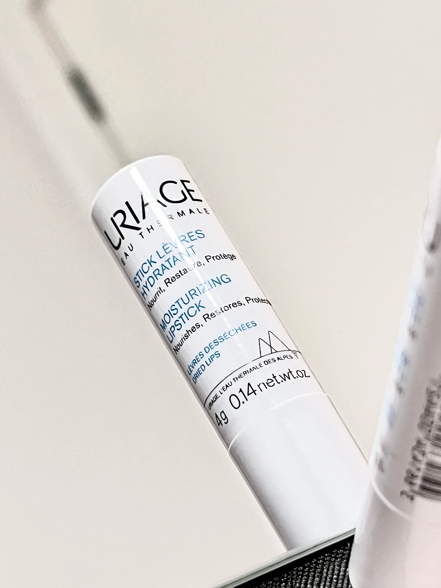
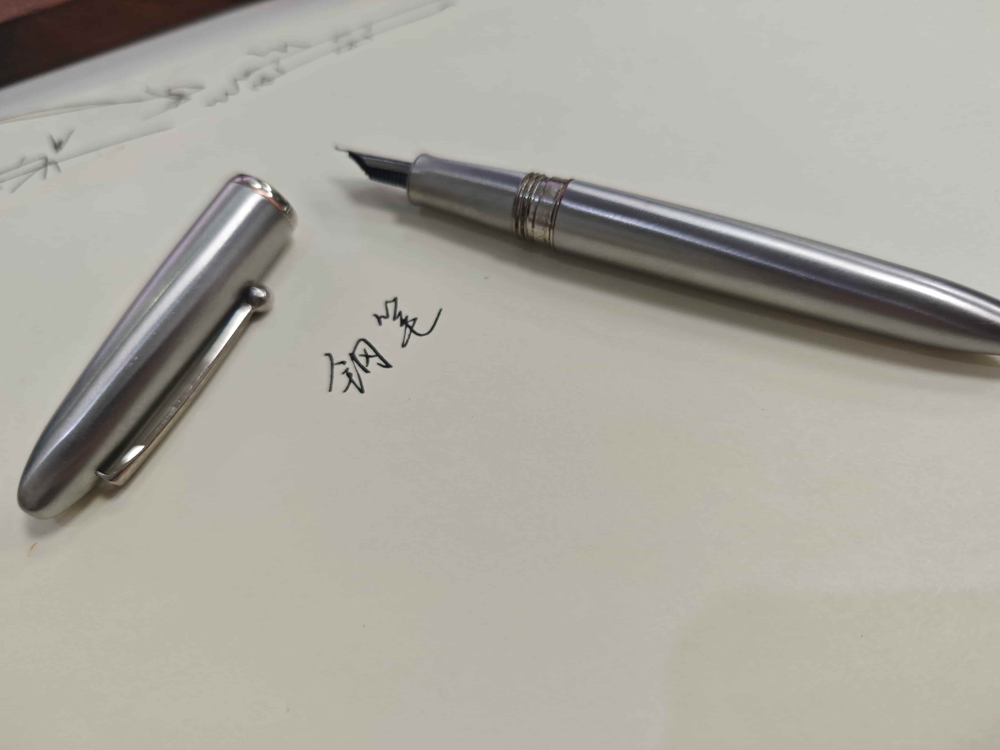
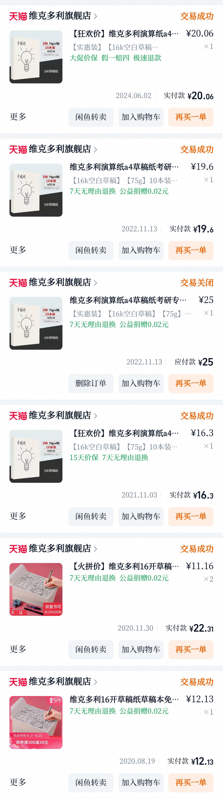

我觉得自己对生活用品是比较挑剔的。所以想记录一些经过时间考验后留在我身边的好物。取名“好物集”。

## 润唇膏

**依泉小白管润唇膏**

我的嘴唇哪怕是夏天，也经常很干，所以润唇膏就成为了必需品。我讨厌很油的润唇膏，也不喜欢有这浓烈味道的，而这只就恰到好处。淡淡的梅味，不腻也不油。唯一的问题就是用久了之后，盖子容易裂开，导致盖不牢靠，不过无伤大雅。

有时候我会饱和式地在我周围环境部署这只润唇膏，宿舍放一只，工位放一只，包包里揣一只。防止人到工位，润唇膏忘在宿舍的痛苦时光。

## 钢笔

**弘典  长岛冰茶 0.6mm 小翘尖**

记得一年级的时候，妈妈有一次去城里，给我带回来一只永生的银色钢笔。刚开始写着不太顺，于是妈妈拿去磨刀石那儿打磨了一下，然后它便成为了我记忆中最好写，也是最好看的钢笔。后来它丢了，我总怀疑是被我同桌偷掉，因为这样的事发生过。那只钢笔便成为了众多童年遗憾中的一个。

然后今年发现了这只钢笔，也是银色，手感无限接近记忆中我认为的那支钢笔，虽然我已经记不清。所以我封这只长岛冰茶为我用过最舒服的钢笔。而且价格只要50块！

## 草稿纸

**认准维克多利旗舰店**

没想到草稿纸也能成为好物分享之一吧？的确是这样。怎么草稿纸还挑吗，难道不是随便找张A4就行的？对我而言不是这样。我很喜欢写字，所以我对笔很挑，对纸当然也很挑，再加上我喜欢用钢笔。那么对纸张的要求就需要它不洇墨、不透、不能太顺滑，得带点阻尼感。而且草稿纸最好能自由撕下，但是也能整本使用。

我在高中的时候，无意间找到一家淘宝店，他们的草稿纸就全面的好，从那时候开始，我的草稿纸一直是他们家的。我甚至感觉他们的草稿纸如果拿来做笔记本，纸张质量都完胜现在很多笔记本（这个我亲测过）。

